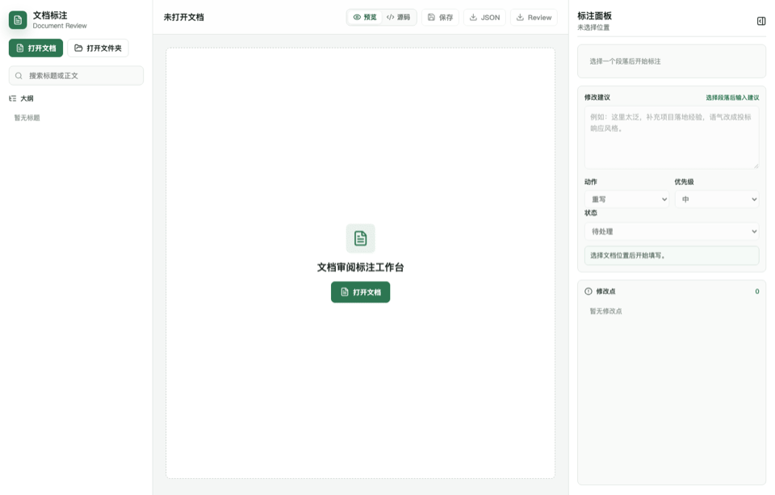
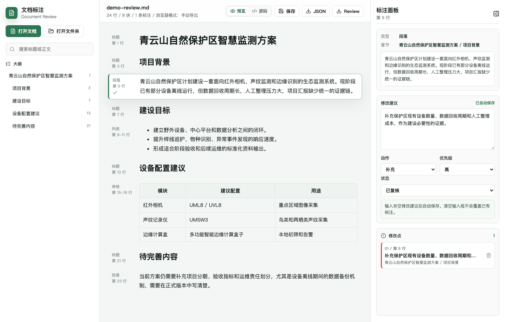
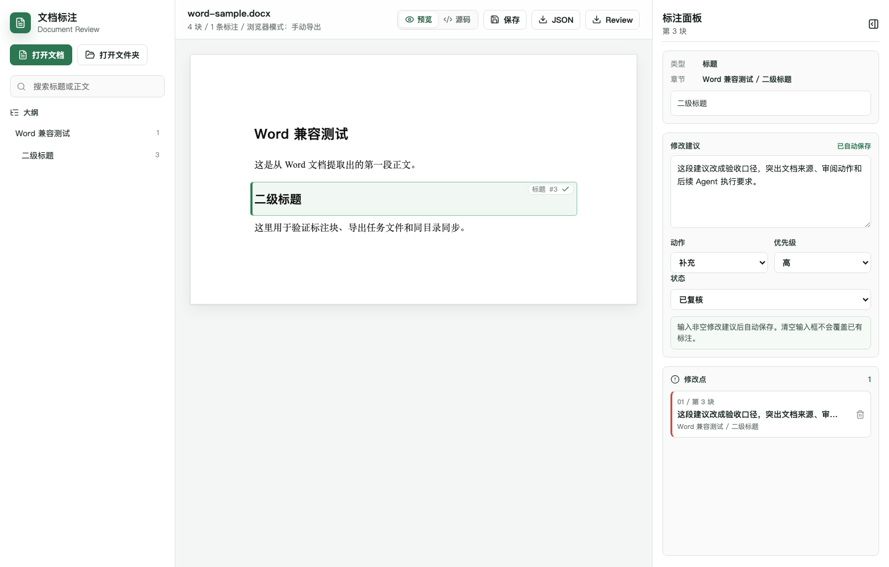
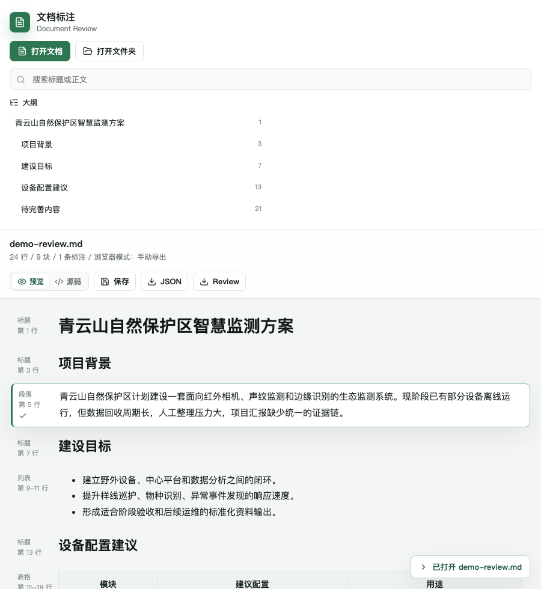

# Markdown / Word 文档审阅标注工作台

一个给内部文档改稿流程用的本地审阅工具。它不直接改原文，也不接入在线 AI API，而是把人工审阅意见整理成 Agent 能稳定读取的结构化任务清单。

适合技术方案、投标稿、产品文档、汇报材料、Word 草稿这类需要反复审阅和定点修改的文档工作。



## 它解决什么问题

很多文档改稿卡在两个地方：

- 审阅意见散在聊天、截图、口头反馈里，后续执行很难追踪。
- 让 AI 改文档时，容易出现改错位置、扩大修改范围、覆盖已有内容的问题。

这个工具把审阅过程拆成更稳的两步：

1. 人在本地预览文档，点击具体段落、标题、表格或列表，写下修改建议。
2. 工具自动生成同目录 sidecar 文件，让人或 Agent 按块执行修改。

原始 `.md` / `.docx` 文件保持不变，所有审阅意见都落到旁边的任务文件里。

## 核心能力

- 支持 `.md`、`.markdown`、`.docx`。
- 按块审阅：标题、段落、列表、表格、引用、代码块。
- Word 文档转为 A4 风格预览，保留标题、表格、列表、加粗、超链接、图片和引用等基础结构。
- 左侧大纲跳转和搜索，适合长文档快速定位。
- 右侧标注面板记录修改建议、动作、优先级和状态。
- 桌面模式自动同步到原文档同目录。
- 最近打开列表和启动自动恢复上次文档。
- 浏览器单文件版本可离线打开使用。

## 输出物

打开 `项目方案.docx` 并完成标注后，会在同目录生成：

```text
项目方案.ai-notes.json
项目方案.review.md
```

`ai-notes.json` 面向 Agent，schema 为 `linjing.markdown-review-notes.v1`。  
`review.md` 面向人工复核，每条修改点都包含原文位置、原文摘录、修改建议和执行要求。

## 界面预览

### 桌面审阅



### Word 文档标注



### 小屏阅读



## 快速开始

### 使用绿色版

如果你已经拿到内部分发的 Windows 绿色版，可以直接运行：

```text
output/portable/Markdown文档审阅标注工作台/Markdown文档审阅标注工作台.exe
```

绿色版属于本地分发产物，不随源码仓库提交；GitHub 源码仓库只保存构建脚本和更新 SOP。绿色版不需要安装，不需要联网。若出现白屏或闪退，安装一次 Microsoft WebView2 Runtime 即可。

### 使用单文件 HTML

从源码使用时，可以先构建单文件 HTML 后直接打开：

```text
output/markdown-review-workbench.html
```

浏览器模式受安全策略限制，不能自动写回原文档目录，需要手动导出 JSON 或 Review Markdown。

## 本地开发

进入前端目录：

```bash
cd src/app
npm install
npm run dev -- --port 5174
```

如果本机安装了 `make`，也可以在仓库根目录使用：

```bash
make dev
make build
make build-html
make tauri-build-no-bundle
```

浏览器访问：

```text
http://127.0.0.1:5174/
```

构建网页版本：

```bash
npm run build
npm run build:html
```

构建 Tauri 桌面版：

```bash
npm run tauri:build -- --no-bundle
```

日常验收如果只刷新绿色版，请遵守 [绿色版更新 SOP](docs/packaging/绿色版更新SOP.md)，不要误刷 MSI、NSIS、zip 或版本号。

## 项目文档入口

- [docs/README.md](docs/README.md)：项目文档索引，按 product / development / packaging / status / handoff / optimization 分区。
- [AGENTS.md](AGENTS.md)：未来 Codex / Claude 接手本仓库的地图。
- [docs/handoff/session-handoff.md](docs/handoff/session-handoff.md)：当前接手状态、下一步和风险。
- [docs/status/PROGRESS.md](docs/status/PROGRESS.md)：历史状态账本和能力索引。

## 项目结构

```text
.
├── src/app/                 # React / Vite / Tauri 应用
├── docs/                    # 文档索引与分区：product / development / packaging / status / handoff / acceptance / optimization / notes
├── assets/demo/             # README 截图和动图
├── output/                  # 本地构建产物和验收截图，不进入 Git
├── AGENTS.md                # Agent 接手地图
├── Makefile                 # 根目录开发命令快捷入口
└── README.md                # GitHub 展示页
```

## 当前边界

- 标注粒度是块级，不是字级。
- Word 排版是基础观感级还原，不保留页眉页脚、分栏、文本框、SmartArt、公式和复杂版式。
- 不会写回原 Word 或 Markdown，sidecar 文件是唯一输出。
- 不支持多人实时协作，跨设备协作依赖 sidecar 文件传递。
- 第一版不接入在线 AI API。

## 给 Agent 的典型使用方式

拿到导出的 `*.review.md` 或 `*.ai-notes.json` 后，可以这样派活：

```text
请读取这个修改任务文件，按里面的标注定点修改原文档。
只修改标注对应位置，其他内容保持不变；涉及事实信息时回源核验。
```

这个工具负责把审阅意见整理好，真正的修改动作交给人或 Agent 执行。这样改稿更可追踪，也更不容易误伤原文。
