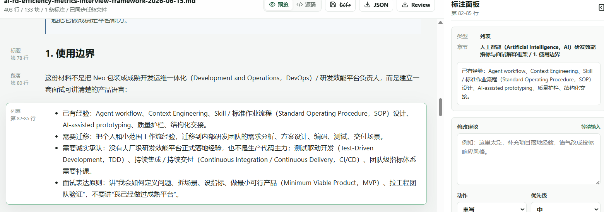

# 优化点清单 · 2026-06-17

> 本批次记录 2026-06-17 发现的 Markdown 阅读器优化点。
> 先收集、后确认、再实施。截图放在 `screenshots/`。

**集中模块**：文档预览 / 标注面板 / 标注粒度 / Markdown 修订

> **实施进度（2026-06-17）**：已实施；完成 `npm run build`、`npm run build:html` 与浏览器冒烟测试，未打包 exe。

| 编号 | 标题 | 涉及模块 | 截图 | 状态 | 备注 |
|---|---|---|---|---|---|
| OPT-001 | 选中文本需要在预览区持久显性标记 | 文档预览 / 标注面板 | 有 | 已完成 | 已对已保存片段显示持久高亮，并支持从右侧列表回跳 |
| OPT-002 | 支持段内句子或片段级批注 | 文档预览 / 标注粒度 / 导出 | 有 | 已完成 | 同一块内可保存多条片段批注，导出记录片段原文和块内偏移 |
| OPT-003 | Markdown 非破坏式修订模式 | Markdown 预览 / 修订记录 / 导出 | 无 | 已完成 | Markdown 支持替换、删除、插入式 sidecar 修订记录，不覆盖原文 |

---

## 明细

### OPT-001 选中文本需要在预览区持久显性标记

- **涉及模块**：预览区文本选中、右侧标注面板、已有标注回显。
- **现状**：用户选中某段文字后，右侧标注面板会自动显示当前选中的修改项和上下文，但文档预览区缺少一个稳定记录“我到底选中了哪段文字”的显性展示。当前截图中浏览器原生蓝色选区会在点击其他区域后消失，只剩块级边框，用户后续回看时不容易确认批注对应的精确文本。
- **期望**：在预览页面对已选中的文字增加持久、可读的视觉标记，例如下划线、高亮底色、边缘标记、批注序号锚点，或与右侧标注卡片联动的 hover / focus 状态。标记应能区分“当前正在选中”和“已经保存为批注目标”的状态。
- **影响**：提升批注可追溯性，减少长段落或密集文本中“批注到底指向哪句话”的误判，也方便多人或后续 agent 根据导出的任务文件理解修改范围。
- **截图**：
- **状态**：已完成
- **实施结果**：预览正文对已保存片段显示持久标记；当前选中/列表聚焦的片段有额外描边；右侧列表点击可回跳到对应片段。

### OPT-002 支持段内句子或片段级批注

- **涉及模块**：预览区文本选择、标注数据结构、右侧标注面板、导出 `ai-notes.json` / `review.md`。
- **现状**：用户有时不想修改整个段落或列表块，只想针对同一段中的某几句话提出批注。当前交互更偏向“选中一个块后记录一次编辑”，在长段落、列表项、Word 转换后的复杂块中，批注粒度不够细，容易把不需要修改的文字也纳入修改范围。
- **期望**：支持在同一个段落或块内选择一句话、几句话或局部片段后单独创建批注；同一块内应允许存在多条片段级批注，并在预览区分别显示对应范围。右侧面板和导出文件需要记录片段原文、所属块、片段偏移或可恢复定位信息，避免只保留整段上下文。
- **影响**：提高修改建议精度，尤其适合技术方案、投标文件、访谈框架等长段落文本审阅；也能减少导出任务中的歧义，让后续人工或 agent 只处理真正需要改的句子。
- **截图**：
- **状态**：已完成
- **实施结果**：`ReviewNote` 增加 `selectionRange`；同一块可保存多条片段级记录；`ai-notes.json` 与 `review.md` 导出块内字符偏移和片段原文。

### OPT-003 Markdown 非破坏式修订模式

- **涉及模块**：Markdown 文档预览、标注/修订模式切换、sidecar 数据结构、导出应用修订后的 Markdown 副本。
- **现状**：当前工具更偏“批注 / 修改建议收集器”，适合复杂审阅意见；但实际审阅中还有大量轻量修改场景，例如改错别字、替换一句话、删除冗余段落、微调标题措辞。如果这些都写成批注建议，操作和后续处理都偏重。
- **期望**：新增 Markdown 专属的非破坏式修订模式，初期只支持 `.md` / `.markdown`，暂不扩展到 `.docx`。原始 Markdown 默认仍不被静默改写；用户可从阅读器进入“修订模式”或“编辑修订”，对选中块或选中片段执行替换文本、删除文本/段落、插入补充内容等轻量操作。修订结果以 sidecar 方式记录，例如写入 `*.ai-notes.json` 的 `changes` 字段，而不是直接覆盖原文。界面中需要展示类似 Word 修订模式的痕迹，例如删除线、插入高亮、替换前后对比。后续可支持导出“应用修订后的 Markdown 副本”，由用户确认后生成，不自动覆盖原文件。现有批注能力继续保留：复杂问题用批注建议，轻量问题用直接修订。
- **影响**：显著降低轻量审阅的操作成本，让工具从“修改建议收集器”扩展为“轻量修订工作台”，同时继续保持不污染原文档的安全边界。该能力也可与 `OPT-001` 的显性标记和 `OPT-002` 的片段级定位形成基础依赖关系。
- **截图**：无
- **状态**：已完成
- **实施结果**：右侧面板新增“批注 / 修订”记录类型；Markdown 文档可记录替换、删除、插入修订，修订写入 sidecar 的 `changes` / `revision` 字段，预览中显示删除线、替换后文本或插入文本。

---

## 验收记录

- `npm run build`：通过（Vite 仍提示 chunk 体积警告）。
- `npm run build:html`：通过，输出 `output/markdown-review-workbench.html`。
- 浏览器冒烟测试：通过。覆盖首屏加载、Markdown 上传、片段批注、Markdown 修订、持久标记、右侧记录、JSON/Review 导出内容。
- 打包范围：按用户要求，未打包 exe，未刷新绿色版。
